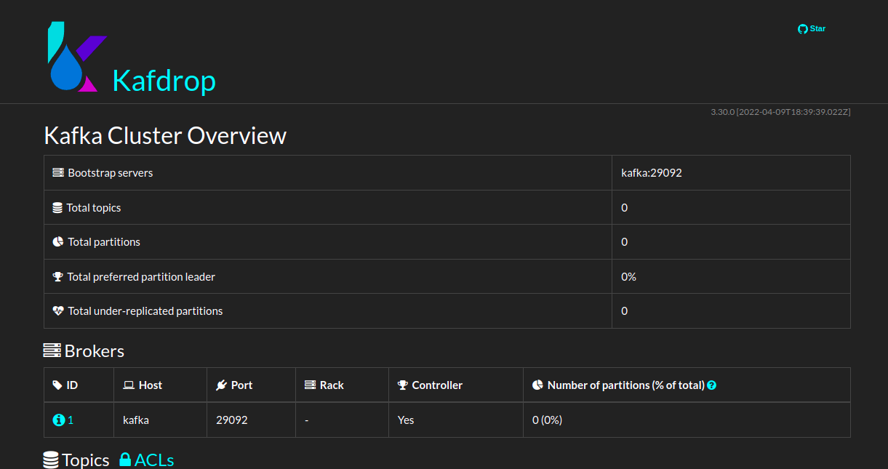
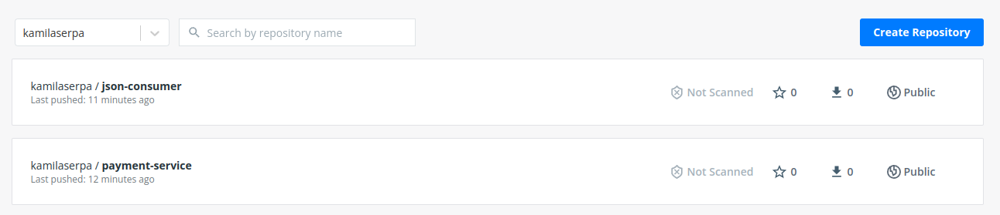

# Apache Kafka

Projeto de estudo do [Apache Kafka](http://kafka.apache.org). O Apache Kafka é uma plataforma de streaming de eventos distribuídos de código aberto (mensageria).

Tecnologias:
 - Apache Kafka
 - Java 11
 - Spring Boot
 - Docker
 - Maven

Projeto base do instrutor: [curso-apache-kafka](https://github.com/ValdirCezar/curso-apache-kafka).

## Zookeeper e Kafdrop

[Apache ZooKeeper](http://zookeeper.apache.org/) é um serviço centralizado para manter informações de configuração, nomear, fornecer sincronização distribuída e oferecer serviços de grupo.

[Kafdrop](https://github.com/obsidiandynamics/kafdrop) é uma interface de usuário da web para visualizar tópicos do Kafka e navegar em grupos de consumidores. A ferramenta exibe informações como agentes, tópicos, partições, consumidores e permite visualizar mensagens.

Para baixar as imagens e executar os containers Zookeeper, Kafdrop execute `docker-compose up -d` .
A interface gráfica Kafdrop será exibida ao acessar `http://localhost:19000`.

Obs.:
 - `docker-compose down` pode ser executado para parar os containers.

## Conceitos iniciais

Os **produtores** são os aplicativos clientes que publicam (gravam) eventos no Kafka e os **consumidores** são aqueles que assinam (leem e processam) esses eventos.

### Tópicos

Os eventos são organizados e armazenados de forma durável em **tópicos**, um tópico tem a função de conter mensagens semelhante a uma pasta em um sistema de arquivos. 
Os tópicos no Kafka são sempre multiprodutores e multiassinantes, podem ter zero, um ou muitos produtores/consumidores. 
Os eventos não são excluídos após o consumo. Deve-se definir por quanto tempo o Kafka deve reter seus eventos por meio de uma configuração por tópico.

Para tornar seus dados tolerantes a falhas e altamente disponíveis, todos os tópicos podem ser replicados 

#### Partições

Os tópicos são particionados, divididos em partições importantes para escalabilidade dos dados. 
Eventos com a mesma chave são gravados na mesma partição.

Uma partição pode conter zero ou vários grupos de consumo.
Não é possível haver maior número de grupos de consumo com o mesmo ID, do que número de partições, pois algum deles não consegue se inscrever em partição nenhuma.

## Docker

Para executar a aplicação através do Docker construa os arquivos `.jar` do produtor [Payment Service](paymentservice_app) e do consumidor [Json Consumer](jsonconsumer_app) através do Maven (`mvn clean package`).  
Construa as imagens docker localmente com `docker build -t <nome-da-aplicacao> .` na pasta de cada aplicação. Siga nomenclatura definida no [docker-compose.yml](docker-compose.yml). Mais detalhes no README de cada projeto.

Execute as imagens com `docker-compose up`.

Para registrar as imagens no Docker Hub, realize login com `docker login`, em seguida faça _upload_ das imagens:
 - `docker push kamilaserpa/payment-service:1.0.0`
 - `docker push kamilaserpa/json-consumer:1.0.0`

As imagens deste projeto estão registradas no Docker Hub e podem ser acessadas através dos links: 
 - [https://hub.docker.com/repository/docker/kamilaserpa/json-consumer](https://hub.docker.com/repository/docker/kamilaserpa/json-consumer);
 - [https://hub.docker.com/repository/docker/kamilaserpa/payment-service](https://hub.docker.com/repository/docker/kamilaserpa/payment-service). 

## Spring
Documentação do Spring de suporte ao Apache Kafka pode ser encontrada em [Spring for Apache Kafka](https://spring.io/projects/spring-kafka) e [Apache Kafka Support](https://docs.spring.io/spring-boot/docs/current/reference/html/messaging.html#messaging.kafka).

## Developer

[Kamila Serpa](https://kamilaserpa.github.io)

[1]: https://www.linkedin.com/in/kamila-serpa/
[2]: https://gitlab.com/java-kamila
[3]: https://github.com/kamilaserpa

[][1]
[][2]
[][3]
